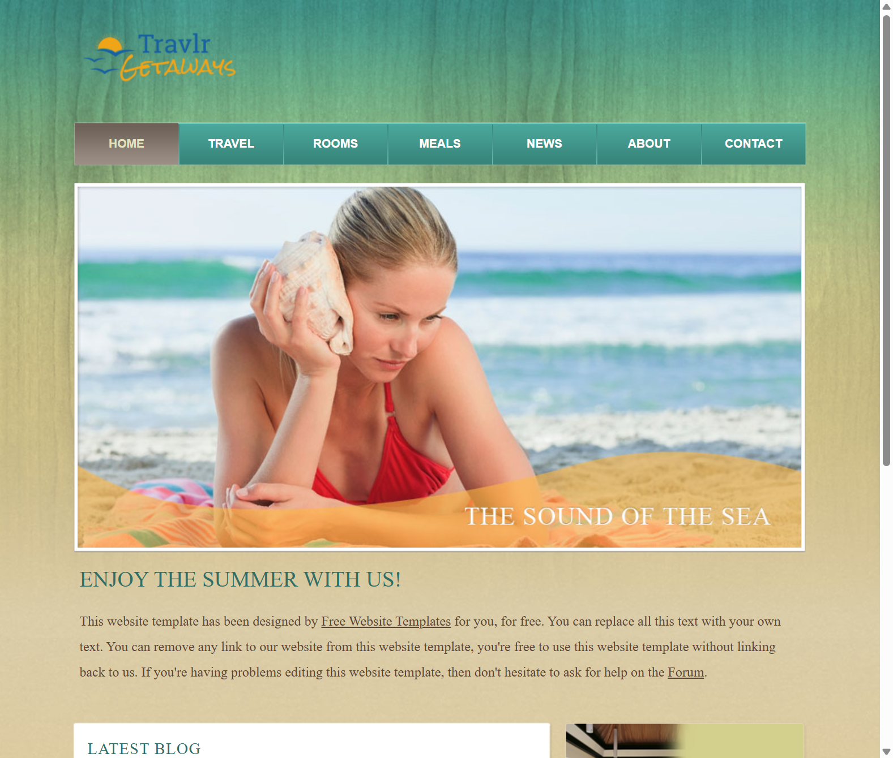
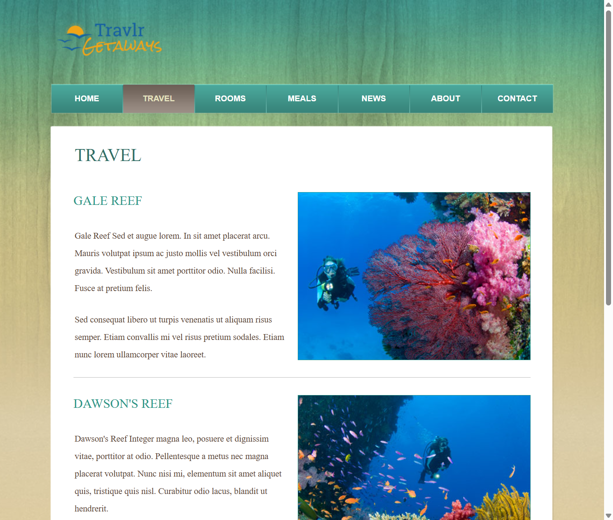
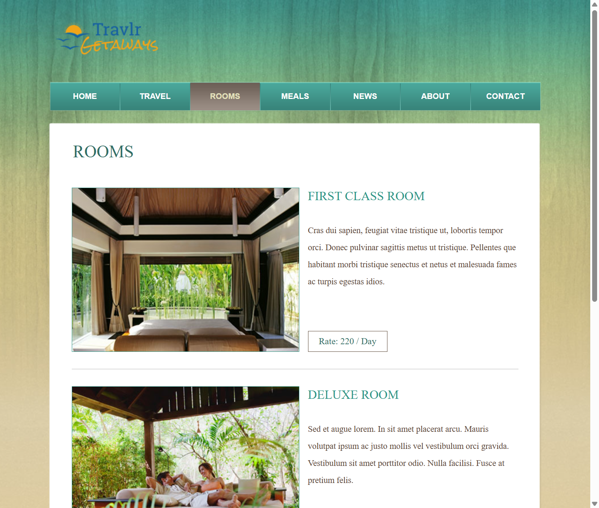
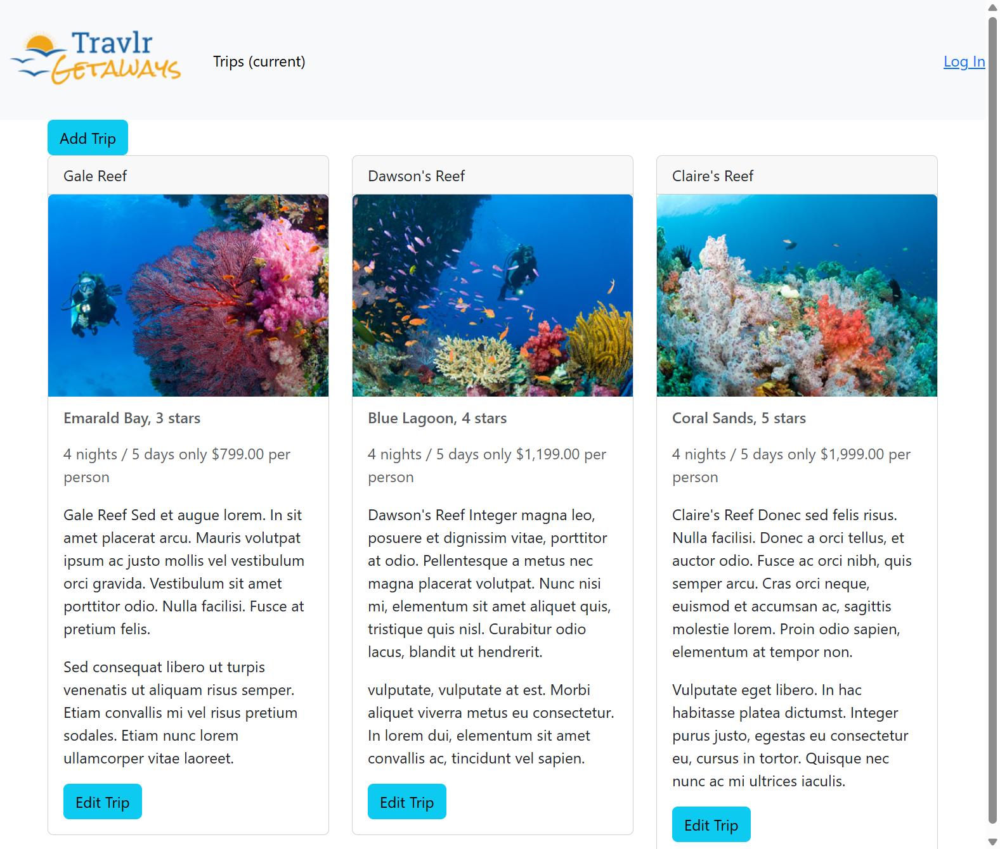
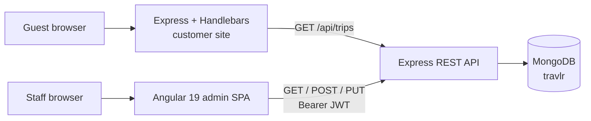

# Travlr Getaways

A full-stack travel platform for a beach-resort brand: guests browse dive trips, rooms, and meals, while staff manage the live trip catalog from a secured admin app.

This is the finished CS-465 MEAN stack product — a customer website, REST API, and Angular admin SPA sharing one MongoDB catalog.

<p align="center">
  
</p>

**Customer site** `http://localhost:3000` &nbsp;·&nbsp; **Admin** `http://localhost:4200` &nbsp;·&nbsp; **API** `http://localhost:3000/api`

## Product

| Guest experience | Staff console |
| --- | --- |
| Resort marketing site with Home, Travel, Rooms, Meals, About, and Contact | Angular SPA for listing, adding, and editing trips |
| Travel page rendered from MongoDB, not static HTML | Login with JWT stored in the browser |
| Shared Handlebars header/footer on dynamic pages | Write operations rejected without a valid token |









## Architecture



| Layer | Location | Role |
| --- | --- | --- |
| Customer UI | `app_server/` | MVC site with Handlebars views and partials |
| REST API | `app_api/` | Trips CRUD, registration, login, Passport + JWT |
| Admin UI | `app_admin/` | Standalone Angular app for catalog management |
| Data | MongoDB `travlr` | `trips` and `users` collections |

Public trip reads are open. Creating or updating a trip requires `Authorization: Bearer <token>`. Passwords are stored as salted PBKDF2 hashes, not plaintext.

## API

| Method | Path | Auth | Purpose |
| --- | --- | --- | --- |
| `GET` | `/api/trips` | No | List all trips |
| `GET` | `/api/trips/:tripCode` | No | Fetch one trip |
| `POST` | `/api/trips` | JWT | Create a trip |
| `PUT` | `/api/trips/:tripCode` | JWT | Update a trip |
| `POST` | `/api/register` | No | Create a user and return a token |
| `POST` | `/api/login` | No | Authenticate and return a token |

Seeded packages include **Gale Reef**, **Dawson's Reef**, and **Claire's Reef**.

## Tech stack

- **MongoDB** + Mongoose
- **Express** 4 with Handlebars
- **Angular** 19 (standalone components, reactive forms, HTTP interceptor)
- **Node.js**
- Passport Local, JSON Web Tokens, `dotenv`

## Run it locally

**Needs:** Node.js, npm, and MongoDB running on `127.0.0.1`.

1. Install dependencies (repo root and admin app):

```powershell
npm install
cd app_admin
npm install
```

2. Create a `.env` in the repo root:

```
JWT_SECRET=replace-with-a-long-random-string
```

3. Seed the trip catalog (run from `app_api` so the relative data path resolves):

```powershell
cd app_api
node ./models/seed.js
```

4. From the repo root, start the API and customer site:

```powershell
npm start
```

5. In a second terminal, start the admin app:

```powershell
cd app_admin
npm start
```

6. Register a staff user, then sign in at [http://localhost:4200/login](http://localhost:4200/login):

```powershell
curl -X POST http://localhost:3000/api/register `
  -H "Content-Type: application/json" `
  -d "{\"name\":\"Admin\",\"email\":\"admin@example.com\",\"password\":\"Password123\"}"
```

Open [http://localhost:3000](http://localhost:3000) for the guest site and [http://localhost:3000/travel](http://localhost:3000/travel) for the live catalog.

## What this shows

Travlr was built to practice shipping a real full-stack product, not a single isolated tutorial:

- Modular Express apps for the public site and the API
- A data-driven UI that stays in sync when the catalog changes
- SPA-to-API integration with CORS and a JWT interceptor
- Authentication and authorization on mutating routes
- A course progression from a static Express site (`module1`) to this finished baseline (`module7`)

`main` is the finished Module 7 baseline. Earlier course snapshots remain on `module1`–`module6`.
